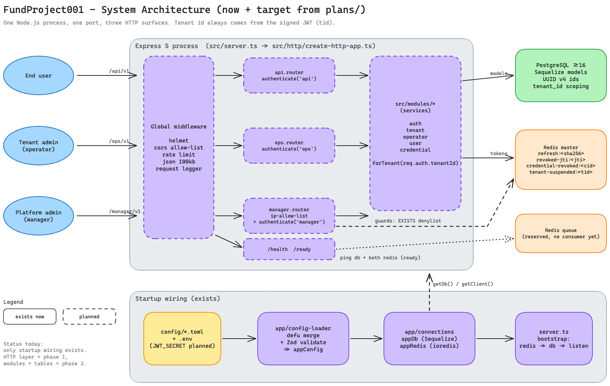
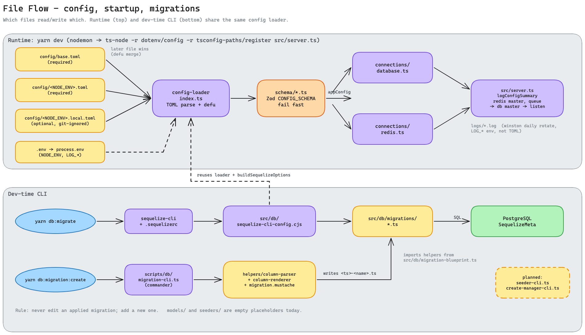
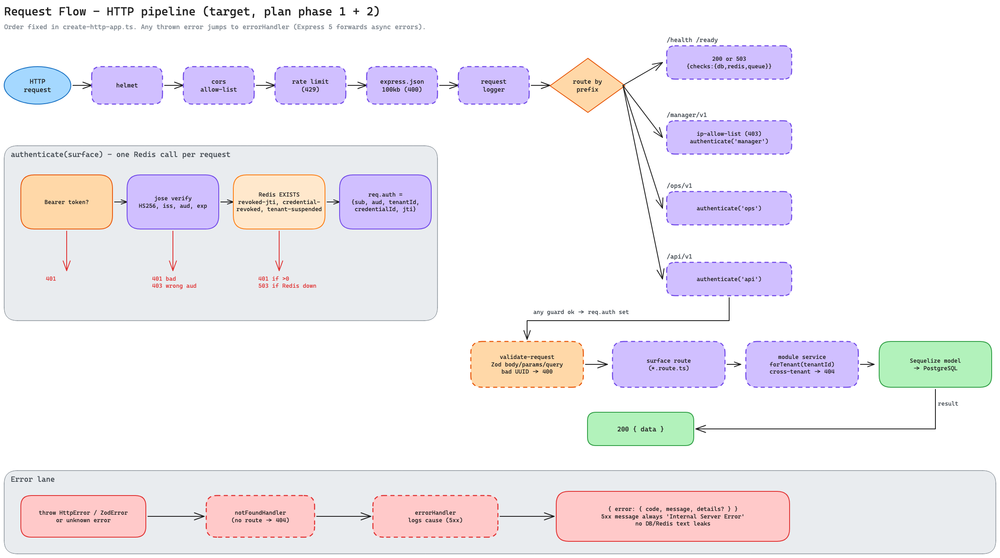
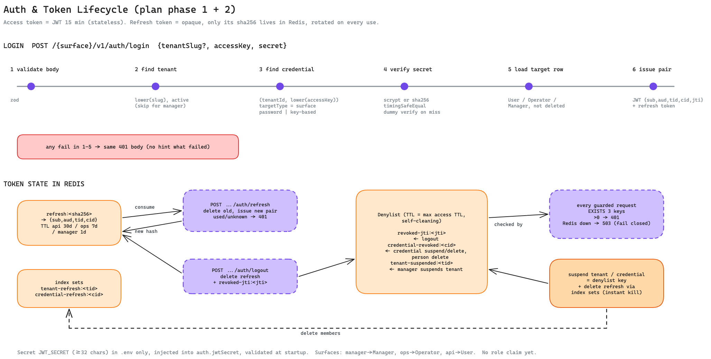
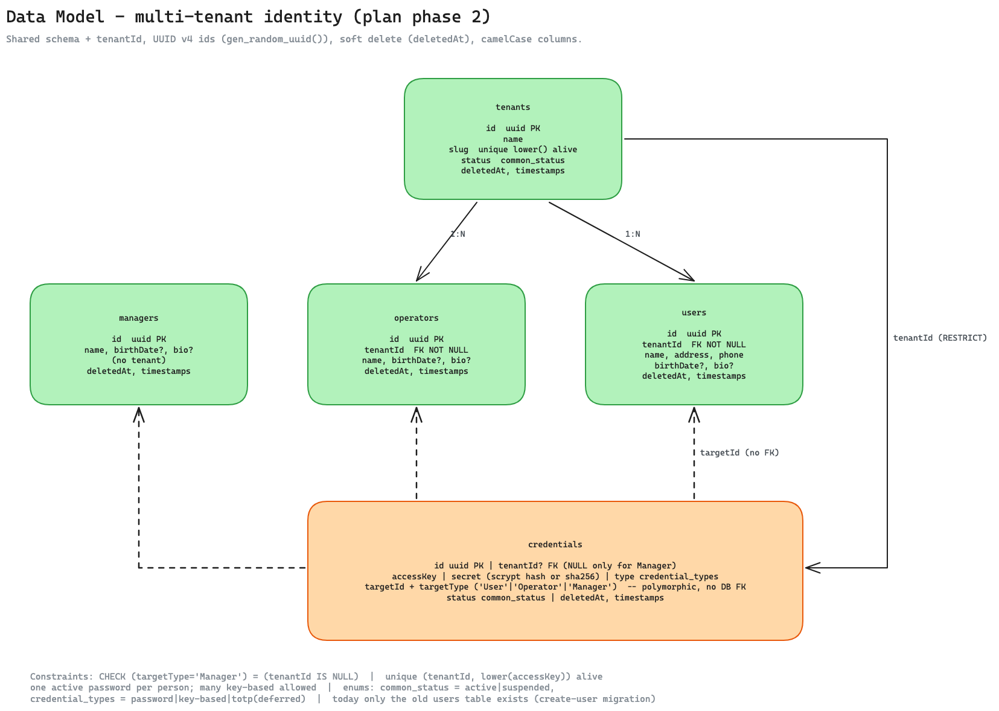

# System Diagrams

Visual map of the project: what exists today plus the target from
[`plans/260930-2128-project-hardening-roadmap`](../../plans/260930-2128-project-hardening-roadmap/plan.md).
Dashed shapes = planned (not in code yet). Solid = exists now.

Source files are in `docs/architecture/diagrams/*.excalidraw`; open them at
<https://excalidraw.com> (File > Open) to edit, then re-export the PNG.

| # | Diagram | Answers |
|---|---------|---------|
| 1 | [System architecture](#1-system-architecture) | Which pieces exist, how clients, surfaces, modules, Postgres and Redis connect |
| 2 | [File flow](#2-file-flow) | Which files feed config, startup and migrations |
| 3 | [Request flow](#3-request-flow) | Middleware order, auth guard, handler chain, error contract |
| 4 | [Auth and token lifecycle](#4-auth-and-token-lifecycle) | Login steps, refresh rotation, revocation keys in Redis |
| 5 | [Data model](#5-data-model) | Multi-tenant identity tables and constraints |

## 1. System architecture

Today only the startup wiring (config loader, connections, `server.ts`) exists.
HTTP layer = phase 1, modules and tables = phase 2.

## 2. File flow

Runtime and the Sequelize CLI share one config loader, so both connect with the same settings.

## 3. Request flow

Target pipeline from phase 1 (`src/http/create-http-app.ts`) and phase 2 (modules).

## 4. Auth and token lifecycle

## 5. Data model

Keep these diagrams in sync when a roadmap phase lands: switch the shapes that
became real from dashed to solid.
