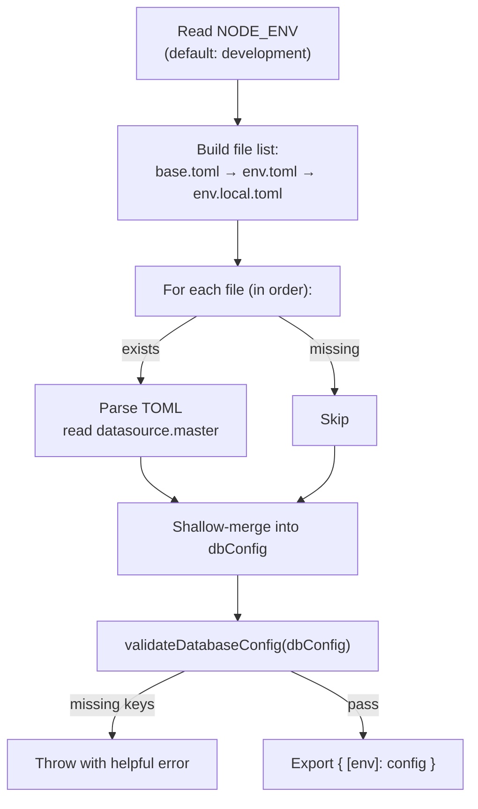
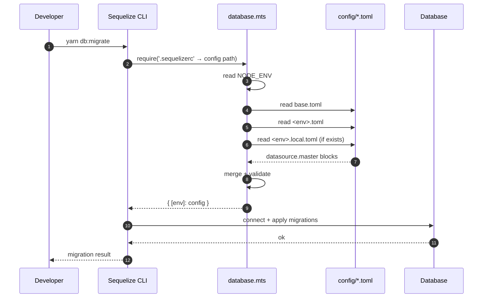

# Database Config Loader (`src/config/database.mts`)

## Overview

`src/config/database.mts` is the **runtime configuration entry point** for both the application and **Sequelize CLI**. It reads layered TOML files, validates the merged result, and exports a Sequelize-CLI-shaped object so the same config drives:

- the application's Sequelize connection at runtime, and
- every Sequelize CLI command (`db:migrate`, `db:seed`, `model:generate`, etc.).

It is the bridge described in [sequelize-and-sequelize-cli-relationship.md](./sequelize-and-sequelize-cli-relationship.md) — the file Sequelize CLI loads through `.sequelizerc`.

---

## How Sequelize CLI Finds It

The project root [`.sequelizerc`](../../.sequelizerc) tells Sequelize CLI where to look:

```js
module.exports = {
  'config': path.resolve('src', 'config', 'database.mts'),
  'models-path': path.resolve('src', 'db', 'models'),
  'seeders-path': path.resolve('src', 'db', 'seeders'),
  'migrations-path': path.resolve('src', 'db', 'migrations'),
};
```

- `require('ts-node/register')` — compiles TS on demand.
- `require('tsconfig-paths/register')` — resolves `tsconfig.json` path aliases.
- `config` — points at `database.mts`. Sequelize CLI `require`s this file and reads its default export.
- The `.mts` extension suppresses Node's `MODULE_TYPELESS_PACKAGE_JSON` warning when the file is loaded as ESM.

---

## What the File Does



### Step-by-step

1. **Determine environment** — `process.env.NODE_ENV || 'development'` (see [Line 46](src/config/database.mts#L46)).
2. **Build the candidate file list** in ascending precedence:
   1. `config/base.toml`
   2. `config/<env>.toml`
   3. `config/<env>.local.toml`
3. **Iterate and merge** — for each existing file, read it, parse TOML, and shallow-merge the `datasource.master` block into a running config object. Missing files are skipped silently (see [Lines 51-66](src/config/database.mts#L51-L66)).
4. **Validate** — every required key must be present and non-empty, otherwise an error is thrown listing exactly which keys are missing (see [Lines 31-43](src/config/database.mts#L31-L43)).
5. **Export a Sequelize-CLI-shaped object** keyed by the current environment (see [Lines 73-79](src/config/database.mts#L73-L79)).

### Why the keyed object

Sequelize CLI expects either a flat config or an environment-keyed object. This file returns the keyed form:

```ts
const config = { [env]: loadDatabaseConf() };
export default config;
```

So running `NODE_ENV=production npx sequelize-cli db:migrate` makes the CLI pick `config.production`. Running without `NODE_ENV` (defaults to `development`) picks `config.development`.

---

## The Contract

```ts
export interface SequelizeDatasourceCLI {
  username: string;
  password: string;
  dialect: string;
  schema: string;
  database: string;
  host: string;
  port: number;
}
```

These are the **only fields the loader guarantees** and the **only fields Sequelize CLI strictly needs**. Anything else (pool sizing, SSL options, dialect-specific flags) is not part of this contract — the runtime Sequelize instance reads richer config from the full TOML tree via the project's main config loader, while this file stays minimal and CLI-compatible.

### Required keys

```ts
const REQUIRED_KEYS: (keyof SequelizeDatasourceCLI)[] = [
  'username', 'password', 'dialect',
  'schema',   'database', 'host', 'port',
];
```

A key is considered missing when it is `undefined`, `null`, or `''` (empty string).

### Validation

The validator uses a TypeScript **assertion signature**:

```ts
type ValidateDatabaseConfig = (
  config: Partial<SequelizeDatasourceCLI>
) => asserts config is SequelizeDatasourceCLI;
```

This is what narrows the type after the function returns — the cast on [Line 70](src/config/database.mts#L70) (`dbConfig as SequelizeDatasourceCLI`) is safe because the assertion already proved it.

---

## Layered Override Order

The loader merges three TOML files in strict precedence (later wins):

```
base.toml               ← defaults, committed
   ↓ overridden by
<env>.toml              ← env-specific values, committed (development.toml, staging.toml, production.toml)
   ↓ overridden by
<env>.local.toml        ← machine-local overrides, gitignored
```

This is the same layered pattern documented in [configuration.md](./configuration.md#configuration-loading--override-order). The database loader is a **thin specialization** of that pattern scoped to the `datasource.master` block — it exists because Sequelize CLI only reads a single config module and needs the merged values inline.

| `NODE_ENV`     | Files merged                                            |
|----------------|---------------------------------------------------------|
| `development`  | `base.toml` → `development.toml` → `development.local.toml` |
| `staging`      | `base.toml` → `staging.toml` → `staging.local.toml`     |
| `production`   | `base.toml` → `production.toml` → `production.local.toml` |

> See [configuration.md](./configuration.md) for the full TOML schema (pool, SSL options, Redis, logging, etc.). Only the `datasource.master` block flows through this loader.

---

## Example TOML

```toml
# config/base.toml — committed, shared defaults
[datasource.master]
dialect = "postgres"
host    = "localhost"
port    = 5432
schema  = "public"
database = "app"
username = "app"
password = "app"
```

```toml
# config/development.toml — committed, env-specific
[datasource.master]
host     = "db.dev.internal"
database = "app_dev"
```

```toml
# config/development.local.toml — gitignored, local-only
[datasource.master]
username = "minh"
password = "my_local_pg_pw"
```

When `NODE_ENV=development`, the loader merges those three blocks and exports:

```js
{ development: {
    dialect: "postgres",
    host: "db.dev.internal",        // overridden by development.toml
    port: 5432,                     // from base.toml
    schema: "public",               // from base.toml
    database: "app_dev",            // overridden by development.toml
    username: "minh",               // overridden by development.local.toml
    password: "my_local_pg_pw",     // overridden by development.local.toml
} }
```

---

## Run-time Integration



---

## Error Behavior

If any required key is missing, the loader throws **before** Sequelize CLI gets a chance to connect:

```
[Database Configuration Error]: Missing or empty required configuration keys:
  - password
  - schema
Please ensure these attributes are defined across base.toml, <env>.toml, or <env>.local.toml.
```

This fail-fast behavior surfaces config mistakes at command start instead of as a confusing `ECONNREFUSED` deep inside Sequelize.

---

## Notes & Limitations

- **Only `datasource.master`** is read. The contract is intentionally minimal — keep richer settings (pool, SSL, timeouts) in the broader config loader and reference them from runtime code, not from this file.
- **Shallow merge** — keys at the top level of `datasource.master` are replaced wholesale by later files. Sub-tables are not recursively merged.
- **No array merging** — arrays (if any are added later) are replaced, not concatenated.
- **No environment variable interpolation** — passwords are stored verbatim in TOML. Use `<env>.local.toml` (gitignored) for secrets, or inject via the broader config loader's `${VAR}` resolution.
- **One block per file** — only the `datasource.master` section is consumed. If you add `[datasource.replica]`, this loader will ignore it.

---

## Related Docs

- [configuration.md](./configuration.md) — full TOML schema and layered override rules.
- [environment-configuration.md](./environment-configuration.md) — how `NODE_ENV` is populated via `dotenv`.
- [sequelize-and-sequelize-cli-relationship.md](./sequelize-and-sequelize-cli-relationship.md) — the design-time vs runtime diagram this loader sits inside.