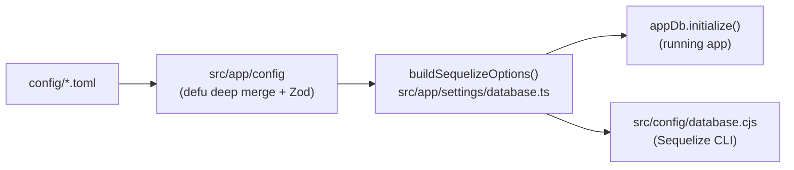

# Database Config Loader (`src/config/database.cjs`)

## Overview

`src/config/database.cjs` is the config file **Sequelize CLI** loads (`db:migrate`, `db:seed`, …).
It does not read TOML itself. It reuses the application's config loader, so the CLI and the running
app always connect with the **same** settings:


```mermaid
flowchart LR
    TOML["config/*.toml"] --> AppConfig["src/app/config<br/>(defu deep merge + Zod)"]
    AppConfig --> Builder["buildSequelizeOptions()<br/>src/app/settings/database.ts"]
    Builder --> Runtime["appDb.initialize()<br/>(running app)"]
    Builder --> CLI["src/config/database.cjs<br/>(Sequelize CLI)"]
```

One loader, one mapping: pool, SSL, and timeouts set in TOML apply to migrations too.

---

## How Sequelize CLI Finds It

[`.sequelizerc`](../.sequelizerc):

```js
require('ts-node/register');
require('tsconfig-paths/register');

module.exports = {
  'config': path.resolve('src', 'config', 'database.cjs'),
  // models-path, seeders-path, migrations-path ...
};
```

- `ts-node/register` lets the `.cjs` file `require()` the TypeScript sources.
- `tsconfig-paths/register` resolves the `src/*` alias used across the code base.

### Why `.cjs` and not `.ts` / `.mts`

Sequelize CLI loads the config with `import()`. On Node ≥ 22.18, `import()` of a `.ts`/`.mts` file
goes through Node's **built-in type stripping** instead of ts-node. That path cannot resolve the
`src/*` alias and cannot load the rest of the TypeScript sources. It also fails on ESM-only
dependencies such as `defu` ("module not been linked"). A `.cjs` file is loaded with `require()`,
so the whole chain runs through ts-node + tsconfig-paths, the same way `yarn dev` runs the app.

---

## What It Exports

```js
module.exports = {
  [NODE_ENV]: buildSequelizeOptions(appConfig.datasource.master),
};
```

Keyed by environment, so `NODE_ENV=production yarn db:migrate` makes the CLI pick
`config.production`. Example output for `development` (password masked):

```json
{
  "dialect": "postgres", "host": "localhost", "port": 5432,
  "schema": "public", "database": "fund_project_dev",
  "username": "postgres", "password": "***",
  "pool": { "min": 0, "max": 10, "acquire": 30000, "idle": 10000 },
  "dialectOptions": { "ssl": false, "connectTimeout": 60000 }
}
```

---

## Layered Override Order

Same as the app, see [configuration.md](./configuration.md):

```
base.toml → <env>.toml → <env>.local.toml (optional, gitignored)
```

The merge is **deep** (`defu`): a nested table like `[datasource.master.pool]` in `production.toml`
only overrides the keys it sets.

---

## Error Behavior

Validation is the Zod schema in `src/app/config/schema/`. It runs before the CLI connects. The CLI
therefore also requires valid `redis` and `env` sections, because it loads the full app config.
An empty `username` or `password` fails fast:

```
Config validation warning:
  - datasource.master.username: username is required (set it in <env>.toml or <env>.local.toml)
  - datasource.master.password: password is required (set it in <env>.toml or <env>.local.toml)
```

---

## Notes & Limitations

- **Only `datasource.master`** is exported to the CLI.
- **`.env` is not loaded** by `yarn db:migrate`. `NODE_ENV` must come from the shell.
- The CLI prints the `[config]` log lines, because it uses the same loader as the app.

---

## Related Docs

- [configuration.md](./configuration.md): full TOML schema and override rules.
- [environment-configuration.md](./environment-configuration.md): how `NODE_ENV` is set.
- [sequelize-and-sequelize-cli-relationship.md](./sequelize-and-sequelize-cli-relationship.md): how the CLI and the runtime library relate.
