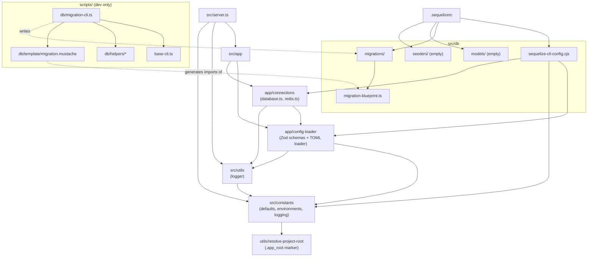

# Project Structure

## Directory Layout

```text
.
├── config/            # TOML runtime config (base -> <env> -> <env>.local)
├── docs/              # Evergreen docs
├── logs/              # Winston output (git-ignored, .gitkeep only)
├── scripts/           # Dev CLI tools (not shipped in dist)
│   ├── base-cli.ts
│   ├── console.ts
│   └── db/            # migration-cli, helpers, mustache template
├── src/
│   ├── server.ts      # Entry point
│   ├── app/           # Runtime wiring: config + connections
│   ├── constants/     # Static values (defaults, environments, logging)
│   ├── db/            # migrations, models, seeders, Sequelize CLI config
│   └── utils/         # Logger, project-root resolver
└── tests/             # Empty, no test runner configured yet
```

## Module Dependencies



Note: `constants/defaults.ts` imports `src/utils/resolve-project-root` directly, not the
`src/utils` barrel, because the barrel re-exports the logger, which imports `src/constants`.
