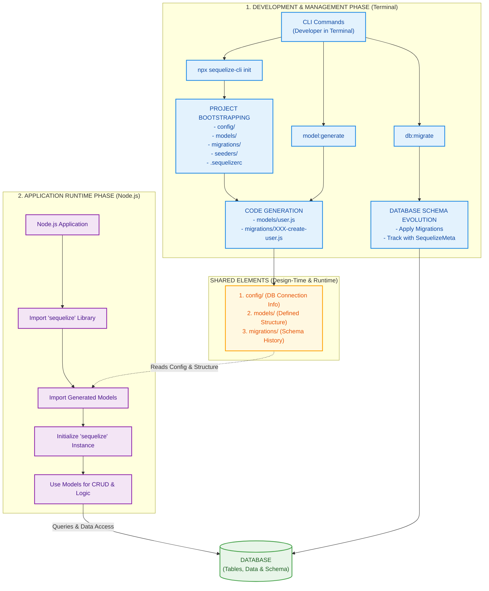

```mermaid
graph TD
    %% Styling Definitions
    classDef devPhase fill:#e3f2fd,stroke:#1e88e5,stroke-width:2px,color:#0d47a1;
    classDef runtimePhase fill:#f3e5f5,stroke:#8e24aa,stroke-width:2px,color:#4a148c;
    classDef sharedElem fill:#fff8e1,stroke:#ffa000,stroke-width:2px,color:#e65100;
    classDef dbStyle fill:#e8f5e9,stroke:#43a047,stroke-width:2px,color:#1b5e20;

    %% Subgraph 1: Development & Management
    subgraph DEV ["1. DEVELOPMENT & MANAGEMENT PHASE (Terminal)"]
        CLI["CLI Commands<br/>(Developer in Terminal)"]
        InitCmd["npx sequelize-cli init"]
        GenCmd["model:generate"]
        MigrateCmd["db:migrate"]

        Bootstrap["PROJECT BOOTSTRAPPING<br/>- config/<br/>- models/<br/>- migrations/<br/>- seeders/<br/>- .sequelizerc"]
        CodeGen["CODE GENERATION<br/>- models/user.js<br/>- migrations/XXX-create-user.js"]
        SchemaEvol["DATABASE SCHEMA EVOLUTION<br/>- Apply Migrations<br/>- Track with SequelizeMeta"]
    end

    %% Subgraph 2: Shared Elements
    subgraph SHARED ["SHARED ELEMENTS (Design-Time & Runtime)"]
        SharedFiles["1. config/ (DB Connection Info)<br/>2. models/ (Defined Structure)<br/>3. migrations/ (Schema History)"]
    end

    %% Subgraph 3: Application Runtime
    subgraph RUNTIME ["2. APPLICATION RUNTIME PHASE (Node.js)"]
        App["Node.js Application"]
        ImportLib["Import 'sequelize' Library"]
        ImportModels["Import Generated Models"]
        InitSeq["Initialize 'sequelize' Instance"]
        RunCRUD["Use Models for CRUD & Logic"]
    end

    %% Target Database
    DB[("DATABASE<br/>(Tables, Data & Schema)")]

    %% Connections - Development Phase Flow
    CLI --> InitCmd
    CLI --> GenCmd
    CLI --> MigrateCmd

    InitCmd --> Bootstrap
    Bootstrap --> CodeGen
    GenCmd --> CodeGen
    CodeGen --> SharedFiles

    MigrateCmd --> SchemaEvol
    SchemaEvol --> DB

    %% Connections - Runtime Phase Flow
    App --> ImportLib
    ImportLib --> ImportModels
    SharedFiles -. Reads Config & Structure .-> ImportModels
    ImportModels --> InitSeq
    InitSeq --> RunCRUD

    RunCRUD -->|Queries & Data Access| DB

    %% Apply Classes
    class CLI,InitCmd,GenCmd,MigrateCmd,Bootstrap,CodeGen,SchemaEvol devPhase;
    class SharedFiles sharedElem;
    class App,ImportLib,ImportModels,InitSeq,RunCRUD runtimePhase;
    class DB dbStyle;
```